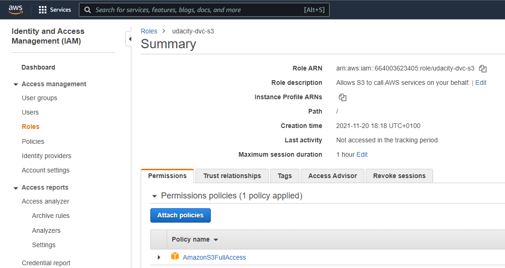
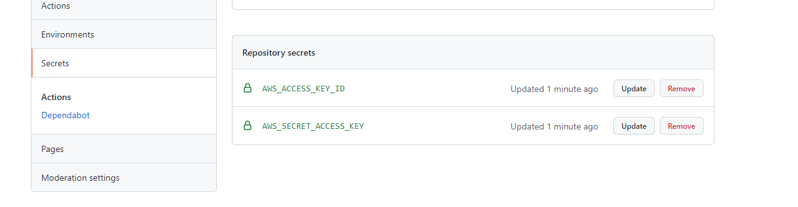
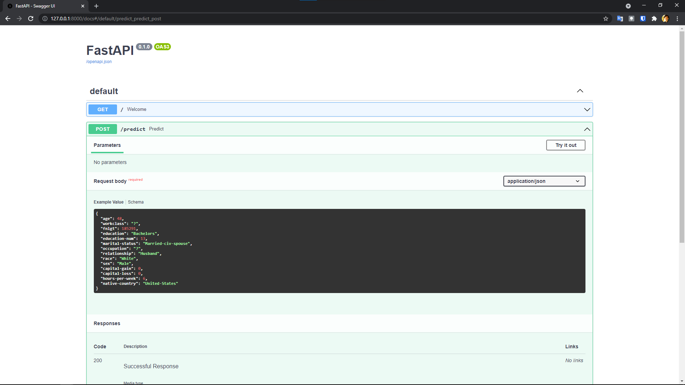
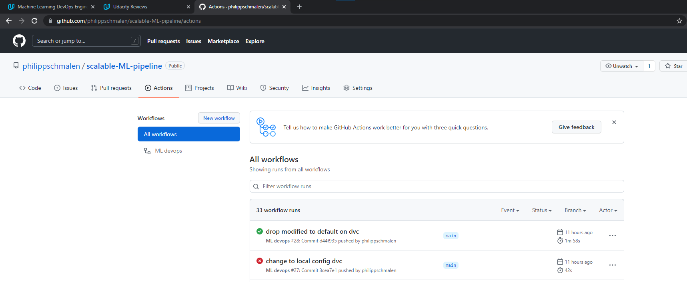

# Scalable ML models with DVC, FastAPI, AWS and Heroku

Project as part of the **Machine Learning Devops Engineer** nanodegree at Udacity.

Link to repo: https://github.com/philippschmalen/scalable-ML-pipeline


---
## TODO

* run script for live-testing


---


## Getting started

Find the starter code [here](https://github.com/udacity/nd0821-c3-starter-code).

```bash
git clone https://github.com/philippschmalen/scalable-ML-pipeline.git
```

### AWS setup

Go through the steps in "Set up S3" below. Configure `$HOME/.aws/credentials` and `$HOME/.aws/config` following [aws docs](https://docs.aws.amazon.com/cli/latest/userguide/cli-configure-profiles.html). I setup `[profile udacity]` and `[udacity]` respectively.

AWS CLI can be used as follows:

```bash
# with [profile udacity] in ./aws/config and [udacity] in .aws/credentials
$ aws s3 ls --profile udacity
2021-10-25 13:29:08 udacity-scalable-ml
```

### DVC

Follow the steps in the [get started docs](https://dvc.org/doc/start).

```bash
dvc init
git add *
git commit -m "init dvc"
git push
dvc remote add -d s3 s3://udacity-scalable-ml
```

#### Different AWS profile than `default`
To complete the setup with AWS CLI, using a different profile than the `default`, modify the remote. I use the profile name `udacity` here.

We need to tell dvc [where to look for credentials](https://dagshub.com/blog/configure-a-dvc-remote-without-a-devops-degree/#:~:text=Next%20we%20need%20to%20tell%20DVC%20how%20to%20ask%20for%20our%20credentials) using `dvc remote modify [remote name] --local [...]`


```bash
# remote name: storage, AWS profile name: udacity
dvc remote modify storage --local profile udacity

dvc remote list
>  storage s3://udacity-scalable-ml/dvcstore

dvc config -l
>   remote.storage.url=s3://udacity-scalable-ml/dvcstore
>   remote.storage.profile=udacity
>   core.remote=storage
```

The project's DVC config in `./dvc/config` now contains

```yaml
# ./dvc/config
[core]
    remote = storage
['remote "storage"']
    url = s3://udacity-scalable-ml/dvcstore

# ./dvc/config.local
# needs profile = udacity as it is the local AWS profile in ./aws/credentials
[core]
    remote = storage
['remote "storage"']
    url = s3://udacity-scalable-ml/dvcstore
    profile = udacity

```

`.aws/credentials` looks like this:

```yaml
[udacity]
aws_access_key_id = asdf
aws_secret_access_key = asdf

[default]
aws_access_key_id = asdf
aws_secret_access_key = asdf
```

### Conda env

```bash
# create conda env
conda env create -f conda.yaml
# if you added a package to conda.yaml or changed versions
conda env update --file conda.yaml --prune
```

If any problems occur for a specific package, run `conda update [package] -y` or `conda env update -f conda.yaml --prune` to have everything up to date.

### Github repo

If you store and pull data from S3 within github actions, it needs credentials.

1. AWS console: create an IAM role on AWS



2. GIthub: vadd secrets to github repo



Add AWS secrets to repo


---


## API

The script `main.py` builds an API. Serve it using

```bash
# note: use the reload flag only for development
uvicorn main:app --reload
# creates api endpoint on localhost:
# http://127.0.0.1:8000/
```

* Root url: `http://127.0.0.1:8000/`
* Automatic documentation: `127.0.0.1:8000/docs`




---

## ML pipeline

The main executable is `src/train_model.py`. It expects a `config.yaml` at the project root `./`.

```bash
# in project root run
conda activate ml-deploy
python src/train_model.py
```

Expect the following training artifacts in their folders:

* logs: `logs/`
* Metrics: `reports/`
* Model: `model/`

### Data exploration

Find the profiling report of the raw data in `reports/census_eda.html`.

### Data preprocessing

Load `data/census.csv` as a pandas dataframe where missings and duplicates are dropped. Then split into features `X` and target `y` and binarize the target for the classification task.

See `src/ml/data.py` for details.

### Model training

I use the Fast and Lightweight AutoML library to train and validate an estimator.

The `config.yaml` contains relevant training settings for automl, for example:

```yaml
automl:
  task: classification
  time_budget: 30
  random_state: 42
  metric: 'roc_auc'
  log_training_metric: True
  log_file_name: "logs/flaml.log",
  eval_method: holdout
  estimator_list:
    - lgbm
```

For details see [FLAML github](https://github.com/microsoft/FLAML).


### Continuous integration

The workflow includes the following parts:

* init python runtime
* configure AWS credentials to enable dvc pulling from s3
* configure dvc and `dvc pull` to download data
* run pytest with `python -m pytest`





---

## Heroku

Install Heroku CLI, create an account and run `heroku login` from CMD.

Add `runtime.txt` to set the python runtime and `requirements.txt` for required packages to the repo.

```bash
# runtime.txt
python-3.8.12

# export with conda
conda env export > requirements_conda.txt --no-builds
# requirements.txt
# replace = with == and keep relevant packages > requirements.txt
```

Build heroku app locally

```bash
# app name: udacity-ml-devops
heroku create udacity-ml-devops --buildpack heroku/python

# list apps
heroku apps

# set remote
heroku git:remote --app udacity-ml-devops

# run bash
heroku run bash --app udacity-ml-devops

# install buildpacks to setup dvc
heroku buildpacks:add --index 1 heroku-community/apt --app udacity-ml-devops

# config aws access or set config vars on heroku app settings
heroku config:set AWS_ACCESS_KEY_ID=... AWS_SECRET_ACCESS_KEY=... AWS_REGION=...
```

Finally, add the `Procfile` which defines a web service.

### Troublehsooting

To inspect logs: `heroku logs --app udacity-ml-devops`


### Continuous deployment

Using github actions [deploy-to-heroku](https://github.com/marketplace/actions/deploy-to-heroku#getting-started) to deploy the app.


#### Sanity check


Running `sanitycheck.py` succeeds:

```bash
(ml-deploy) ./Project deploy ML Heroku FastAPI>python sanitycheck.py
This script will perform a sanity test to ensure your code meets the criteria in the rubric.

Please enter the path to the file that contains your test cases for the GET() and POST() methods
The path should be something like abc/def/test_xyz.py
> tests/test_api.py

============= Sanity Check Report ===========
Your test cases look good!
This is a heuristic based sanity testing and cannot guarantee the correctness of your code.
You should still check your work against the rubric to ensure you meet the criteria.
```


---

# Udacity project instructions

Working in a command line environment is recommended for ease of use with git and dvc. If on Windows, WSL1 or 2 is recommended.

## Environment Set up
* Download and install conda if you don’t have it already.
    * Use the supplied requirements file to create a new environment, or
    * conda create -n [envname] "python=3.8" scikit-learn dvc pandas numpy pytest jupyter jupyterlab fastapi uvicorn -c conda-forge
    * Install git either through conda (“conda install git”) or through your CLI, e.g. sudo apt-get git.

## Repositories

* Create a directory for the project and initialize Git and DVC.
   * As you work on the code, continually commit changes. Trained models you want to keep must be committed to DVC.
* Connect your local Git repository to GitHub.

## Set up S3

* In your CLI environment install the<a href="https://docs.aws.amazon.com/cli/latest/userguide/cli-chap-install.html" target="_blank"> AWS CLI tool</a>.
* In the navigation bar in the Udacity classroom select **Open AWS Gateway** and then click **Open AWS Console**. You will not need the AWS Access Key ID or Secret Access Key provided here.
* From the Services drop down select S3 and then click Create bucket.
* Give your bucket a name, the rest of the options can remain at their default.

To use your new S3 bucket from the AWS CLI you will need to create an IAM user with the appropriate permissions. The full instructions can be found <a href="https://docs.aws.amazon.com/IAM/latest/UserGuide/id_users_create.html#id_users_create_console" target="_blank">here</a>, what follows is a paraphrasing:

* Sign in to the IAM console <a href="https://console.aws.amazon.com/iam/" target="_blank">here</a> or from the Services drop down on the upper navigation bar.
* In the left navigation bar select **Users**, then choose **Add user**.
* Give the user a name and select **Programmatic access**.
* In the permissions selector, search for S3 and give it **AmazonS3FullAccess**
* Tags are optional and can be skipped.
* After reviewing your choices, click create user.
* Configure your AWS CLI to use the Access key ID and Secret Access key.

## GitHub Actions

* Setup GitHub Actions on your repository. You can use one of the pre-made GitHub Actions if at a minimum it runs pytest and flake8 on push and requires both to pass without error.
   * Make sure you set up the GitHub Action to have the same version of Python as you used in development.
* Add your <a href="https://github.com/marketplace/actions/configure-aws-credentials-action-for-github-actions" target="_blank">AWS credentials to the Action</a>.
* Set up <a href="https://github.com/iterative/setup-dvc" target="_blank">DVC in the action</a> and specify a command to `dvc pull`.

## Data

* Download census.csv from the data folder in the starter repository.
   * Information on the dataset can be found <a href="https://archive.ics.uci.edu/ml/datasets/census+income" target="_blank">here</a>.
* Create a remote DVC remote pointing to your S3 bucket and commit the data.
* This data is messy, try to open it in pandas and see what you get.
* To clean it, use your favorite text editor to remove all spaces.
* Commit this modified data to DVC under a new name (we often want to keep the raw data untouched but then can keep updating the cooked version).

## Model

* Using the starter code, write a machine learning model that trains on the clean data and saves the model. Complete any function that has been started.
* Write unit tests for at least 3 functions in the model code.
* Write a function that outputs the performance of the model on slices of the data.
   * Suggestion: for simplicity, the function can just output the performance on slices of just the categorical features.
* Write a model card using the provided template.

## API Creation

* Create a RESTful API using FastAPI this must implement:
   * GET on the root giving a welcome message.
   * POST that does model inference.
   * Type hinting must be used.
   * Use a Pydantic model to ingest the body from POST. This model should contain an example.
    * Hint: the data has names with hyphens and Python does not allow those as variable names. Do not modify the column names in the csv and instead use the functionality of FastAPI/Pydantic/etc to deal with this.
* Write 3 unit tests to test the API (one for the GET and two for POST, one that tests each prediction).

## API Deployment

* Create a free Heroku account (for the next steps you can either use the web GUI or download the Heroku CLI).
* Create a new app and have it deployed from your GitHub repository.
   * Enable automatic deployments that only deploy if your continuous integration passes.
   * Hint: think about how paths will differ in your local environment vs. on Heroku.
   * Hint: development in Python is fast! But how fast you can iterate slows down if you rely on your CI/CD to fail before fixing an issue. I like to run flake8 locally before I commit changes.
* Set up DVC on Heroku using the instructions contained in the starter directory.
* Set up access to AWS on Heroku, if using the CLI: `heroku config:set AWS_ACCESS_KEY_ID=xxx AWS_SECRET_ACCESS_KEY=yyy`
* Write a script that uses the requests module to do one POST on your live API.
